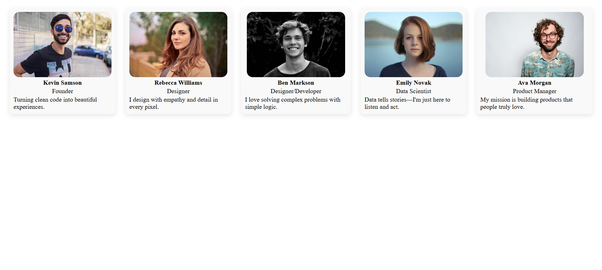
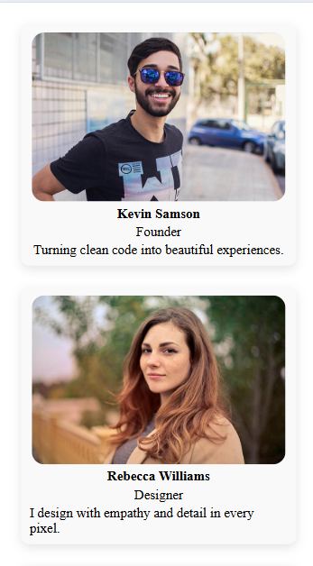

# Responsive Team Cards

## 作業說明

這是第三週的 Flex 排版作業，主要練習 RWD 的應用。內容是設計一組人物介紹卡片，包含圖片、職稱與簡介。

這次作業本來沒什麼特別的想法，我一開始是直接拿第一週作業的 About 頁面來用，把樣式改成五個人物介紹，但這樣看起來其實很平淡。

後來是 ChatGPT 給我很多修改的建議，才慢慢調成有「卡片感」的排版。過程中也加了一些小效果，例如 hover 時陰影會變深，加上 transition 之後，互動看起來也比較順。

## 使用技術

- HTML
- SCSS
- Flexbox
- RWD（Responsive Web Design）

## 頁面預覽

- https://responsive-team-cards.surge.sh

## 頁面截圖

### 💻 桌面版

### 📱 手機版

